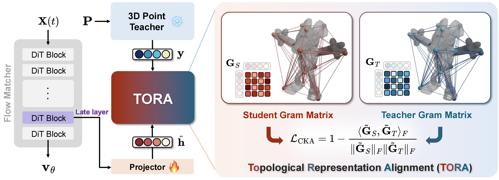

<h1 align="center">TORA: Topological Representation Alignment<br>for 3D Shape Assembly</h1>

<div align="center">

[Nahyuk Lee](https://nahyuklee.github.io/)\*<sup>,1</sup>,
[Zhiang Chen](https://github.com/RCKola)\*<sup>,2</sup>,
[Marc Pollefeys](https://cvg.ethz.ch/team/Prof-Dr-Marc-Pollefeys)<sup>2</sup>,
[Hong Sunghwan](https://sunghwanhong.github.io/)<sup>2,3</sup>

<sup>1</sup> Independent Researcher, <sup>2</sup> ETH Zurich, <sup>2</sup>ETH AI Center &ensp; | &ensp; \* denotes equal contribution

<!-- TODO: Add badges when available -->
<!-- []() -->
[](https://nahyuklee.github.io/tora/)
<!-- []() -->

</div>

<p align="center">
  
</p>

**_TL;DR:_** *Assemble unposed 3D parts into complete objects using rectified flow with teacher-guided topological representation alignment.*

## Table of Contents

- [Overview](#overview)
- [Getting Started](#getting-started)
  - [Setup](#setup)
  - [Teacher Weights](#teacher-weights)
  - [TORA Checkpoints](#tora-checkpoints)
- [Usage](#usage)
  - [Data Preparation](#data-preparation)
  - [Training](#training)
  - [Evaluation](#evaluation)
- [Advanced](#advanced)
  - [Configurations](#configurations)
  - [FAQ](#faq)
- [Citation](#citation)
- [Acknowledgments](#acknowledgments)


## Overview

**TORA** is a topology-first representation alignment framework that distills relational structure from a frozen pretrained 3D encoder into the flow-matching backbone during training. We then extend to employ a Centered Kernel Alignment (CKA) loss to match the similarity structure between student and teacher representations for enhanced topological alignment. Through systematic probing of diverse 3D encoders, we show that geometry- and contact-centric teacher properties, not semantic classification ability, govern alignment effectiveness, and that alignment is most beneficial at later transformer layers where spatial structure naturally emerges.

### Key features
- **Rectified Flow** for point cloud assembly
- **6 teacher encoders**: Uni3D (base/large/giant), Concerto, Find3D, OpenShape, PatchAlign3D, Sonata
- **Projector**: MLP
- **3 alignment losses**: CKA, Cosine, NT-Xent
- **Anchor-free and anchor-based** assembly modes


## Getting Started

### Setup

Clone the repository with submodules:

```bash
git clone --recursive https://github.com/<org>/tora.git
cd tora
```

Create a conda environment with Python 3.10:

```bash
conda create -n tora python=3.10 -y
conda activate tora
```

Install dependencies:

```bash
bash install.sh
```

This environment includes PyTorch 2.5.1, PyTorch3D 0.7.8, and Flash Attention 2.7.4 with CUDA 12.4.


### Teacher Weights

| Model | Size | Description |
|:---|:---|:---|
| `uni3d_base.pt` | 178 MB | Uni3D base encoder |
| `uni3d_large.pt` | 615 MB | Uni3D large encoder |
| `uni3d_giant.pt` | 2.0 GB | Uni3D giant encoder |
| `openshape_model.pt` | 388 MB | OpenShape encoder |
| `patchalign3d_stage2.pt` | 89 MB | PatchAlign3D encoder |

Teacher weights are stored in `pretrained/` and downloaded automatically when needed.

### TORA Checkpoints

> [!NOTE]
> Pretrained TORA checkpoints are not yet available. See [Todo List](#todo-list).


## Usage

### Data Preparation

TORA uses HDF5 format for all datasets. Each file should contain point clouds, normals, per-part counts, and anchor information.

| Dataset | Source | Note
|:---|:---|:---|
| BBad-Everyday, PartNet, TwoByTwo | [RPF](https://github.com/GradientSpaces/Rectified-Point-Flow?tab=readme-ov-file#training-data) | direct download
| BBad-Artifact | [BBad Official](https://breaking-bad-dataset.github.io/) | needs conversion
| Fantastic Breaks | [Fantastic Breaks](https://terascale-all-sensing-research-studio.github.io/FantasticBreaks/) | needs conversion
| Fractura | [GARF](https://ai4ce.github.io/GARF/) | needs symlink setup

Conversion scripts are provided in [`dataset_process/`](dataset_process/):

```bash
# Convert Breaking Bad artifact subset
python dataset_process/convert_artifact_to_h5_igl.py

# Convert Fantastic Breaks
python dataset_process/convert_fantastic_breaks_to_h5.py

# Setup Fractura symlinks
bash dataset_process/setup_fractura.sh
```


### Training

TORA follows the flow model training pipeline as in [RPF](https://github.com/GradientSpaces/Rectified-Point-Flow) (encoder pretraining + flow model training) with a frozen pretrained encoder, but adds representation alignment with frozen teacher models. We recommend training with representation alignment enabled, which is TORA's main contribution.

```bash
python train.py \
    data_root="../dataset" \
    data=main/bbad_everyday \
    model/teacher=uni3d \
    model/projector=mlp \
    model/alignment_loss=cka \
    trainer.devices=8
```

> [!TIP]
> See [RPF's training instructions](https://github.com/GradientSpaces/Rectified-Point-Flow#-training) for details on the base two-stage pipeline (encoder pretraining and flow model training). TORA uses the same `pretrain.yaml` config for encoder pretraining.

<details>
<summary>Available configuration options</summary>

**Teachers**: `uni3d` (default), `concerto`, `find3d`, `openshape`, `patchalign3d`, `sonata`

**Projectors**: `mlp`

**Alignment Losses**: `cka` (default), `cosine`, `nt_xent`

**Datasets**: `main/bbad_everyday`, `main/partnet`, `main/twobytwo`, `main/bbad_artifact`, `main/fantastic_breaks`, `main/fractura`

Override any parameter from the command line:

```bash
# Different teacher and loss
python train.py model/teacher=concerto model/alignment_loss=cosine

# Resume from checkpoint
python train.py ckpt_path=./output/TORA_base/last.ckpt

# Adjust learning rate and batch size
python train.py model.optimizer.lr=1e-4 data.batch_size=32
```

</details>


### Evaluation

Run evaluation on a trained model:

```bash
python sample.py \
    ckpt_path=./output/TORA_base/best.ckpt \
    data_root="../dataset" \
    data=main/bbad_everyday
```

Metrics reported: Chamfer Distance, Part Accuracy, Rotation/Translation RMSE, Recall@5/10 (rotation), Recall@1cm/5cm (translation).


## Advanced

### Configurations

<details>
<summary>Hydra configuration structure</summary>

```
config/
├── train.yaml              # Training entry config
├── sample.yaml             # Inference/evaluation config
├── pretrain.yaml           # Encoder pretraining config
├── data/
│   ├── main/               # Main datasets (bbad_everyday, partnet, twobytwo, ...)
│   ├── rpf/                # RPF-compatible dataset configs
│   └── zeroshot/           # Zero-shot datasets (artifact, fantastic_breaks, fractura)
├── model/
│   ├── tora.yaml           # Main TORA model config
│   ├── feature_extractor/  # Encoder configs (ptv3_object)
│   ├── flow_model/         # DiT architecture config
│   ├── teacher/            # Teacher encoder configs (6 options)
│   ├── projector/          # Projector config (mlp)
│   └── alignment_loss/     # Alignment loss configs (3 options)
├── trainer/                # Lightning Trainer configs
└── loggers/                # Logger configs (wandb)
```

Key parameters in `train.yaml`:
- `seed`: Random seed (default: 42)
- `data_root`: Path to HDF5 dataset directory
- `experiment_name`: Name for WandB and output directory
- `model.encoder_ckpt`: Path to pretrained encoder checkpoint
- `model.flow_model_ckpt`: Path to flow model checkpoint for finetuning

</details>

### FAQ

> [!NOTE]
> FAQ will be updated. Please refer to [GitHub Issues](https://github.com/nahyuklee/tora/issues) for questions in the meantime.


## Citation

```bibtex
@article{lee2026tora,
  title     = {TORA: Topological Representation Alignment for 3D Shape Assembly},
  author    = {Lee, Nahyuk and Chen, Zhiang and Pollefeys, Marc and Hong, Sunghwan},
  journal   = {arXiv preprint arXiv:2604.04050},
  year      = {2026}
}
```


## Acknowledgments

This codebase builds upon [Rectified Point Flow](https://github.com/GradientSpaces/Rectified-Point-Flow) and is inspired by [REPA](https://github.com/VegB/REPA) for representation alignment. We thank the authors of both works for their contributions.


## License

See the [LICENSE](LICENSE) file for details.
